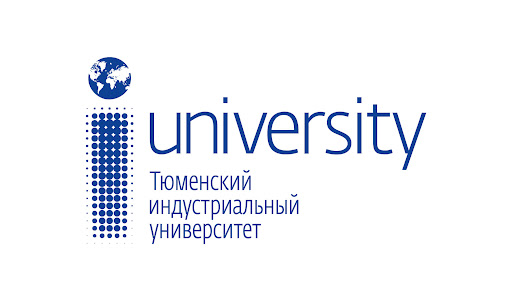

### Портал системной архитектуры Тюменского индустриального университета.

 Навигация по разделам портала осуществляется через боковое меню:
* Архитектура 
  * Аспекты: Раздел, в котором находятся ключевые бизнес-функции, реализуемые системами. Раздел в разработке.
  * Контексты - Раздел, в котором находится описание архитектурных компонентов.
    * Домен 01. Управление ресурсами: Этот домен содержит системы, связанные с управлением ресурсами предприятия.
    * Домен 02. Пользовательские сервисы: Этот домен содержит системы, которые находятся в использовании у конечного пользователя (Студенты/преподаватели).
    * Домен 03. Централизованные ИТ-сервисы: Этот домен содержит системы, обеспечивающие функционирование и работоспособность других доменов.
* Документация - Раздел предназначен для хранения и представления различной документации, описывающей системы предприятия. В данный момент раздел находится в разработке.
* Проблемы - В этом разделе отображаются ошибки, допущенные при описании манифестов.
* Техрадар - Этот раздел предоставляет информацию о используемых на предприятии ИТ-технологиях, включая их текущий статус использования. В данный момент раздел находится в разработке.